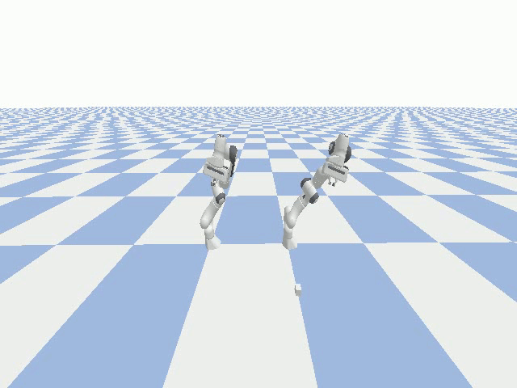
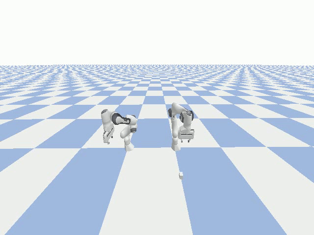

#  Co-operative Control and Trajectory Optimization of two synchronous Panda robots
Executed a co-operative control algorithm for two Franka Emika Panda robots to successfully implement pick-up, handover and place of an object to simulate an industrial automation system

This project is a combination of Optimal Control and Trajectory Planning to implement an industrial pick and place operation. 

The optimization parameter in this project is the Manipulability metric. The Manipulability of a robot can be defined by the ease with which it can reach a specific position. The measurable parameter for Manipulability is the Jacobian of the robot at its location. In this project, the Manipulability of the system was calculated by multiplying the singular values of the Jacobians of both robots and optimized to find the best exchange point on the planned trajectory of the block (object).

How to run the code:
The Handover.ipynb file contains all the environment initialization, optimization code to find the best exchange point and the pick-up-handover-place sequence of the robot manipulation.

The environment consists of two Panda robots and the object in the Pybullet simulation environment.

The code first calculates the Manipulability metric for all posible exchange locations between the two robots. Once it finds the maximum manipulability value, it decides that as the exchange point.

## Pick-up, handover and place sequence using the two Panda robots
The robots go through a sequence of multiple waypoints to pick-up and place the object.

The following gif shows the simulation of this sequence.

We observe that the exchange has taken place at a point where both robots have a combined maximum Manipulability and lowest chance of going into a singular configuration.

